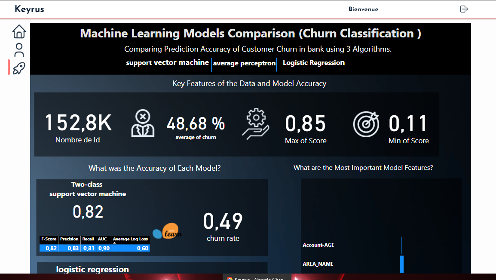
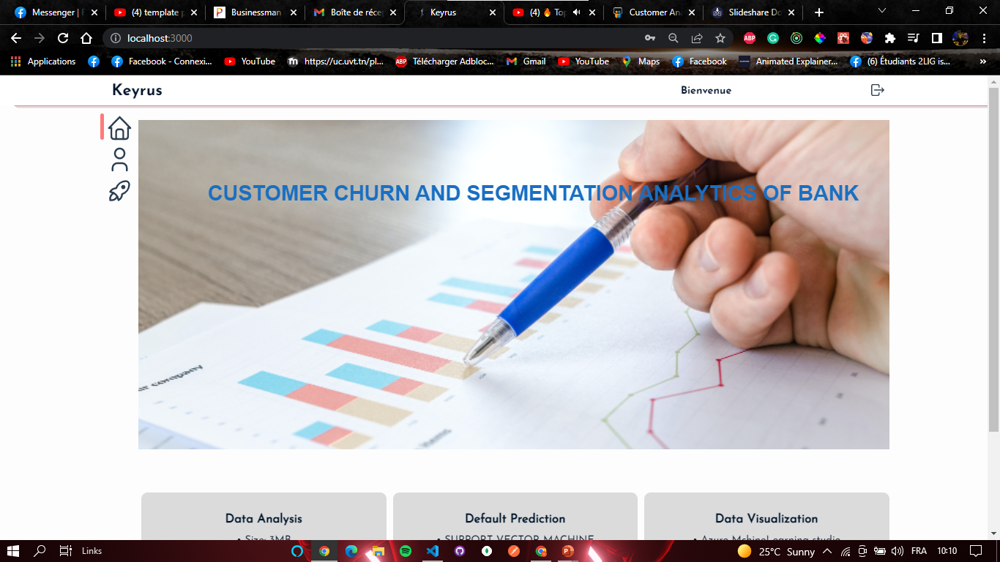
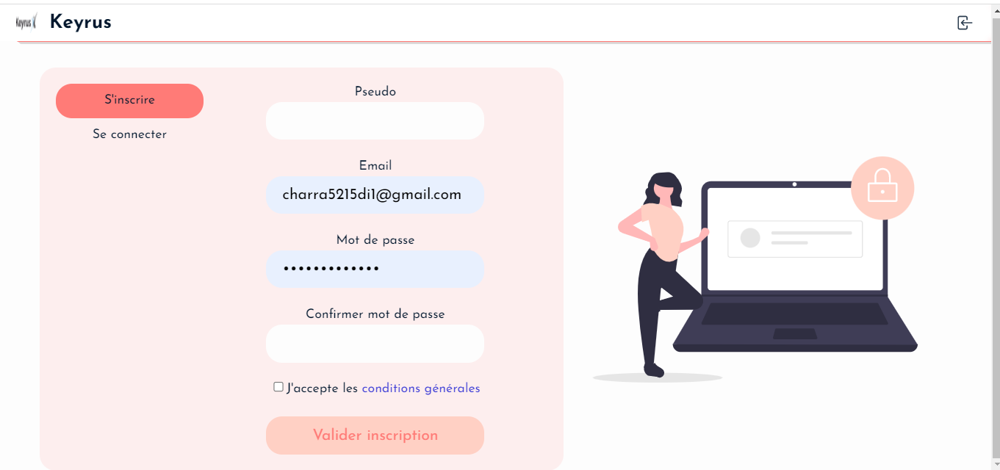
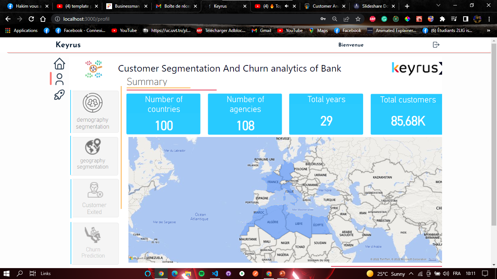
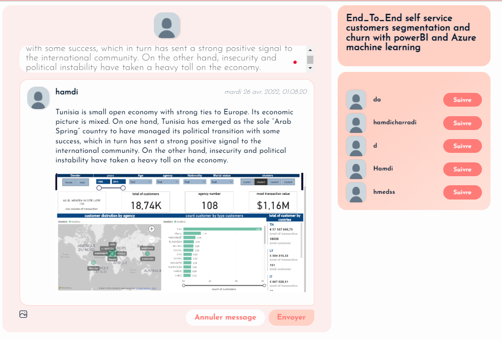
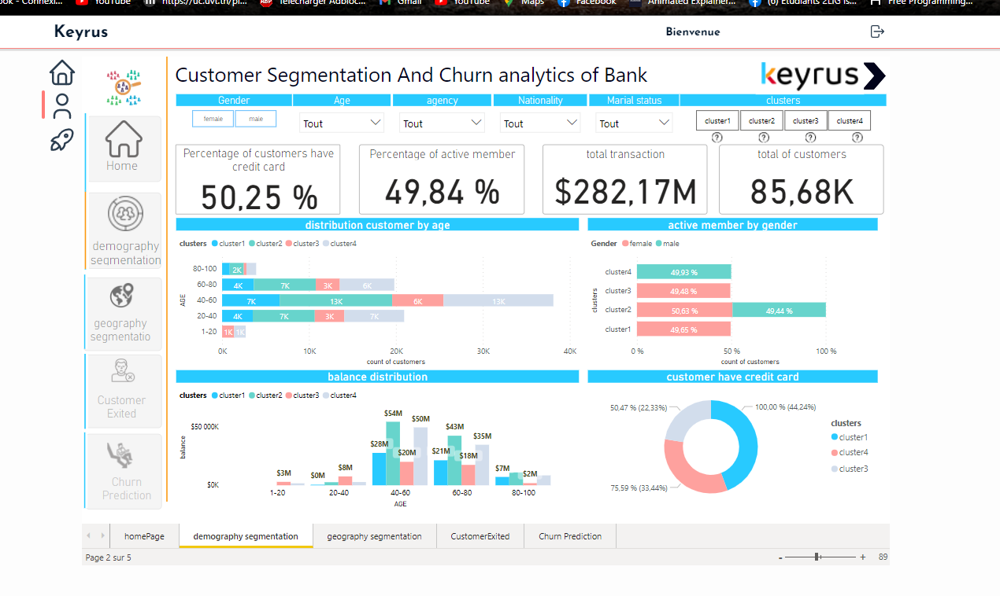

# 🚀 Javascript full-stack 🚀
## MERN Stack
### React / Express / MongoDB / Redux

Start server : `npm start`

Start client : `cd client` + `npm start`

_____________________________

### Back config :

* Put your cluster info inside `/config/db.js`
* Create `.env` file inside `/config/` within the following data
  - PORT=5000 `your localhost port`
  - CLIENT_URL=http://localhost:3000 `your client url`
  - DB_USER_PASS=fs:fromscratch `your ID & -password`
  - ADMIN_URL=http://localhost:4000
  - TOKEN_SECRET=990bf68e6adf1be5f1671bba3bec692056922454 `your random secret key`
  
_________________________
  
### Front config : 
* Create a `.env` file within the server URL :
  - REACT_APP_API_URL=http://localhost:5000/ `your server url`
    
_____________________________

  _____________________________

  _____________________________
  _____________________________

  _____________________________

  _____________________________

  _____________________________

  _____________________________

  _____________________________
💻 Made by Ch.Hamdi. Free to use 
